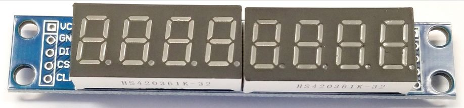
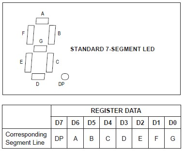

# MAX7219 MicroPython library for Raspberry Pi Pico

[Max7219SevenSegment](https://github.com/vurdalakov/mpy_max7219sevensegment) is a MicroPython library for Raspberry Pi Pico that works with MAX7219 7-segment numeric LED display modules.



## Example

1. Connect Raspberry Pi Pico to MAX7219 module according to the table below.
2. Upload `Max7219SevenSegment.py` file to Raspberry Pi Pico.
3. Run the following code on Raspberry Pi Pico.

| MAX7219 Module |      Pico     |
|----------------|---------------|
| VCC            | 3V3  (pin 36) |
| GND            | GND  (pin 38) |
| DIN            | GP19 (pin 25) |
| CS             | GP17 (pin 22) |
| CLK            | GP18 (pin 24) |

```python
from machine import Pin, SPI
from time import sleep

from Max7219SevenSegment import Max7219SevenSegment

spi = SPI(0, baudrate=100000, polarity=1, phase=0, sck=Pin(18), mosi=Pin(19))
cs = Pin(17, Pin.OUT)

display = Max7219SevenSegment(spi, cs)
display.turn_on()

# set display to show "Hello"
display.set_string('Hello')

sleep(2)

# set display to show "Pi" from 6th digit
display.set_string('Pi', 6)

sleep(2)

# clear display
display.clear_all()

sleep(2)

# set third digit to show "7"
display.set_digit(2, 7)

sleep(2)

# set fifth digit to show "E"
display.set_char(4, 'E')

sleep(2)

# show dot on last digit
display.set_dot(7)

sleep(5)

display.turn_off()
```

## Notes

#### Digit addressing

* Every digit is addressed with an index.
* Digit indexes start with `0` and go from left to right.
* Most of the available modules have 8 digits, so the last possible index is `7`.
* Number of available indexes can be changed in optional `number_of_difits` parameter of class constructor.

#### Supported characters

* The following character set is supported in `set_char()` and `set_string()` methods:
    * digits from `0` to `9`;
    * upper case letters from `A` to `Z`;
    * lower case letters from `a` to `z`;
    * some other characters: `-`, `_`, `°`, `(`, `)`, `[`, `]`;
* Set any other character with `set_mask()` method.

## Reference

#### Constructor

Creates and initializes a Max7219SevenSegment object.

* `spi` parameter should be set to a valid `machine.SPI` object.
* `cs` parameter should be set to a valid `machine.Pin` object that handles the CS output.
* Optional `number_of_difits` parameter can be used to define the number of digits on the MAX7219 module. Default value is `8`.

```python
# import Pin and SPI
from machine import Pin, SPI

# import Max7219SevenSegment
from Max7219SevenSegment import Max7219SevenSegment

# SPI SCK pin is GP18 (pin 24); SPI MOSI pin is GP19 (pin 25)
spi = SPI(0, baudrate=100000, polarity=1, phase=0, sck=Pin(18), mosi=Pin(19))

# CS pin is GP17 (pin 22)
cs = Pin(17, Pin.OUT)

# create display class
display = Max7219SevenSegment(spi, cs)

# test that display is working
display.test_on()
```

#### turn_on()

Turns display on. Brightness is set to 7.

```python
display.turn_on()
```

#### turn_off()

Turns display off. MAX7219 goes to shutdown mode. See MAX7219 data sheet for details.

```python
display.turn_off()
```

#### test_on()

Turns display test on. All LEDs are turned on with maximum brightness. See MAX7219 data sheet for details.

```python
display.test_on()
```

#### test_off()

Turns display test off and restores the previous display.

```python
display.test_off()
```

#### set_brightness()

Sets display brightness to the given value.

* `brightness` parameter can be between `0` (minimum brightness) and `15` (maximum brightness). Default value is `7`.

```python
display.set_brightness(15) # set display to maximum brightness
```

#### set_reverse()

Sets direct (left to right) or reverse (right to left) addressing of digits.

* `reverse` parameter should be set to `False` for direct addressing and to `True` for reverse addressing. Default value is `True`.

All MAX7219 modules that I had tested have reversed order, so normally this method should not be called.
For MAX7219 modules that have direct order of digits call this method with `False` parameter before calling `turn_on()`.

```python
display.set_reverse(False)
```

#### clear_all()

Clears the whole display.

```python
display.clear_all()
```

#### clear()

Clears the specified digit.

* `index` parameter identifies the digit and is described in the Notes section.

```python
display.clear(3) # clear the forth digit
```

#### set_digit()

Draws a number on the specified digit.

* `index` parameter identifies the digit and is described in the Notes section.
* `digit` parameter can be between `0` and `15`. Values starting with `10` are shown as hex digits (from `A` to `F`).
* Optional `dot` parameter turns on the dot LED when set to `True`. Default value is `False`.

```python
display.set_digit(0, 7)           # set first digit to "7"
display.set_digit(1, 15)          # set second digit to "F"
display.set_digit(2, 9, dot=True) # set third digit to "9" and turn on dot LED
```

#### set_char()

Draws a character on the specified digit.

* `index` parameter identifies the digit and is described in the Notes section.
* `char` parameter can be any character from the character set described in the Notes section. Any other character will clear the digit.
* Optional `dot` parameter turns on the dot LED when set to `True`. Default value is `False`.

```python
display.set_char(0, "8")           # set first digit to "8"
display.set_char(1, "E")           # set second digit to "E"
display.set_char(2, "A", dot=True) # set third digit to "A" and turn on dot LED
```

#### set_string()

Draws a string. If the string is longer than the number of digits then extra characters will be ignored. If the string is shorter than the number of digits then remaining digits will be unaffected.

* `string` parameter can contain any characters from the character set described in the Notes section. Any other character will clear the corresponding digit.
* Optional `start` parameter specifies the starting digit. Default value is `0` (first digit).

```python
display.set_char("Hello") # draw "Hello" from the first digits; last 3 digits are not changed
display.set_char("Pi", start=6) # draw "Pi" on last 2 digits; first 6 digits are not changed
```

#### set_dot

Turns on the dot LED for the specified digit. Digit itself is not affected.

* `index` parameter identifies the digit and is described in the Notes section.

```python
display.set_dot(2) # turn on dot LED of the third digit
```

#### clear_dot

Clears the dot LED for the specified digit. Digit itself is not affected.

* `index` parameter identifies the digit and is described in the Notes section.

```python
display.clear_dot(2) # turn off dot LED of the third digit
```

#### set_mask

Turns on any combination of LED segments on the specified digit.

* `index` parameter identifies the digit and is described in the Notes section.
* `mask` parameter contains the _abcdefg_-encoded LED segments to be lit (see table 6 in the MAX7219 data sheet).

```python
display.set_mask(1, 0x70) # draw "7" on the second digit
```



## TODO

* Support cascading MAX7219 modules

## Links

* [MAX7219/MAX7221 product page](https://www.analog.com/en/products/max7219.html)
* [MAX7219/MAX7221 data sheet (PDF)](https://www.analog.com/media/en/technical-documentation/data-sheets/max7219-max7221.pdf)

## License

`Max7219SevenSegment` library is distributed under the terms of the [MIT license](https://opensource.org/licenses/MIT).
